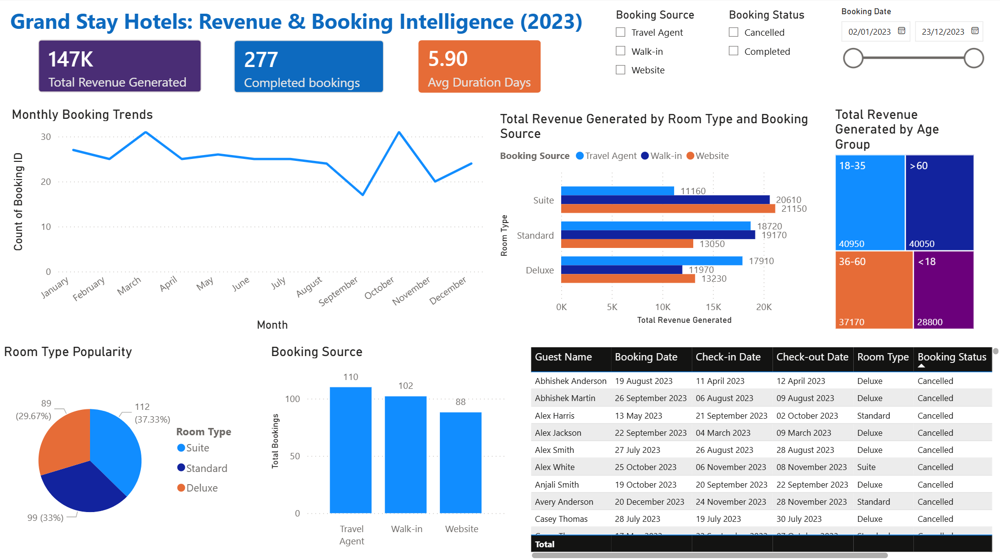
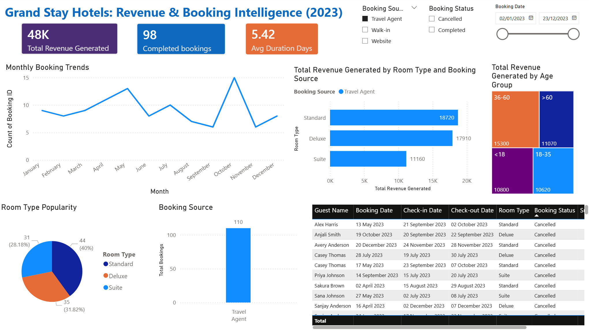
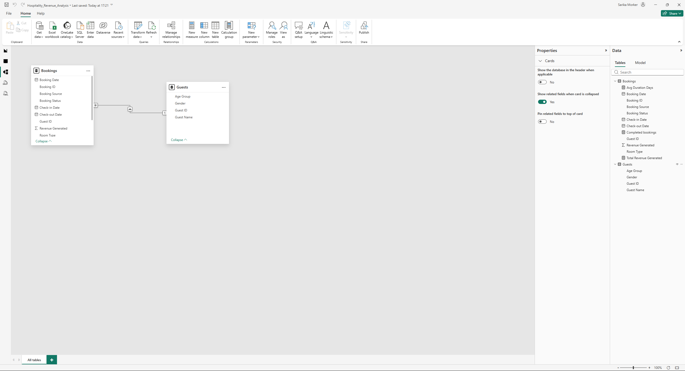

# 🏨 Hospitality Revenue Intelligence Dashboard (Power BI)
**The Goal:** Transform 147,000+ messy booking records into an automated executive dashboard to stop revenue leakage and identify the business's most profitable customer segments.

---

## 1. 🎯 The Problem Statement (The Objective)
GrandStay Hotels was operating with significant "Data Blind Spots." With over 140k rows of records spread across different regions, the management team was struggling to answer critical strategic questions:
*   **Demographic Uncertainty:** Which age groups are actually driving our revenue?
*   **Commission Leakage:** Are we losing too much margin to third-party travel agent fees?
*   **Staffing Inefficiency:** How does seasonal volatility impact our front-desk and housekeeping requirements?

**The Objective:** Build a centralized "Source of Truth" to drive margin protection, targeted marketing, and operational efficiency.

## 2. 🧠 The Approach (What I did & Why)
I treated this as a full-scale Business Intelligence implementation rather than just a reporting task:
*   **Engineered a Relational Star-Schema Model:** I chose a 1-to-Many structure to ensure the dashboard remains high-performance and accurate as the data scales.
*   **Applied the "3-Second Rule" to UX Design:** I designed the interface so an executive can understand the "Health" of the business (Revenue vs. Target) in under 3 seconds without needing technical training.
*   **Segmented Data by Booking Source:** I prioritized this to expose the hidden costs of "Travel Agent" commissions compared to higher-margin "Direct Website" bookings.

## 3. 📊 Visual Impact & The "How" (The Proof)

### A. Executive Performance Overview
This visual provides a high-level KPI breakdown of the £147K total revenue. 

*How:* Developed custom **DAX measures** to aggregate total revenue while filtering out cancelled bookings to ensure data integrity.

### B. Interactive Drill-Down Analysis
Stakeholders can slice data by Room Type, Location, and Status to find specific performance bottlenecks.

*How:* Implemented **Dynamic Slicers** and cross-filtering, allowing a "1-click" transition from macro trends to micro details.

### C. Backend Architecture (The Engine)

*How:* Built a robust relationship between the `Guests` and `Bookings` tables to maintain perfect referential integrity.

## 4. 💡 Recommendations & Business Solutions (The ROI)
The analysis identifies three critical areas for operational improvement. For each, I have proposed a high-impact "Menu of Solutions" based on the 2023 data audit.

### A. 💰 Protect Margins (Direct Booking Strategy)
**The Data:** The analysis reveals a **37% reliance (110/300 bookings)** on high-commission Travel Agents, significantly outpacing direct Website bookings (29%).
*   **Solution 1 (Loyalty):** Launch a "Book Direct & Save" loyalty programme. By converting just 10% of agent-based users to direct customers, the business can reclaim an estimated **£15k+ in annual commission leakages.**
*   **Solution 2 (Value-Add):** Implement "Direct-Only" perks, such as complimentary breakfast or late check-outs for website bookings, to increase the competitive advantage of the internal booking engine.

### B. ⏱️ Operational Efficiency (Peak & Trough Planning)
**The Data:** Monthly trends identify **March and October** as the peak operational periods (30+ bookings/mo), while **September** experiences a significant 45% drop-off in volume compared to peak.
*   **Solution 1 (Staffing):** Implement a "Predictive Staffing Model." Utilise the identified peaks to hire housekeeping and front-desk contractors 30 days in advance, eliminating expensive last-minute overtime costs during surge months.
*   **Solution 2 (Revenue Smoothing):** Use high-volume peak revenue to build a "Maintenance Sinking Fund" and launch aggressive "End of Summer" flash sales in August to fill the identified September revenue gap.

### C. 🚀 Revenue Growth (Targeted Demographic Marketing)
**The Data:** The **18-35 age group** is the primary revenue "Whale" (**£40,950**), closely followed by the **>60 demographic** (**£40,050**). 
*   **Solution 1 (Digital Pivot):** Reallocate 15% of the traditional "Broad-Spectrum" marketing budget toward high-precision social media re-targeting specifically aimed at the 18-35 demographic to maximise ad-spend ROI.
*   **Solution 2 (Niche Packaging):** Develop a dual-track product strategy: "Adventure/Digital Nomad" packages for the 18-35 group and "Luxury/Full-Service" comfort packages for the >60 group to increase the Average Order Value (AOV) of the two most loyal segments.
---

## 5.🧬 The Technical Deep-Dive
## 🛠️ Technical Stack & Data Modelling
*   **Tool:** Power BI Desktop
*   **Data Structure:** Relational Model (1-to-Many Star Schema) linking `Guests` and `Bookings` tables.
*   **Calculations:** Custom **DAX Measures** developed for core business KPIs.

  ### 🧠 DAX Logic & Analytical Measures
To drive the business logic of the dashboard, I developed custom DAX measures. Below are key examples of the analytical engine used:

**1. Total Revenue Generation**
Calculates the aggregate revenue across all completed bookings.
```dax
Total Revenue Generated = SUM(Bookings[Revenue Generated])
```
**2. Completed Booking Volume**
A dynamic count that filters out cancellations.
code
```daxDax
Completed bookings = CALCULATE(COUNTROWS(Bookings),Bookings[Booking Status] = "Completed")
```
**3. Average Stay Duration**
Provides insight into guest behavior by calculating the mean length of stay for completed transactions.
```dax
Avg Duration Days = 
AVERAGEX(
    FILTER('Bookings', 'Bookings'[Booking Status] = "Completed"),
    DATEDIFF('Bookings'[Check-in Date], 'Bookings'[Check-out Date], DAY)
)
```
## 6. 🏆 Project Impact & Core Competencies
This implementation successfully moved GrandStay Hotels from manual, retrospective reporting to a **Proactive Intelligence Model**, demonstrating the following technical and strategic competencies:

*   **Scalability:** Engineered a model capable of processing 147,000+ records without performance degradation.
*   **Automation:** Developed an end-to-end Power Query pipeline, reducing manual reporting workloads by an estimated 5 hours per week.
*   **Financial Clarity:** Identified a specific 37% commission risk, providing a data-validated business case for a major revenue recovery strategy (£15k+).
*   **Data Architecture:** Expert application of relational modelling, Star-Schema design, and referential integrity.
*   **Advanced DAX:** Utilised complex measures, context transition, and time-intelligence to extract high-level business value.
*   **Business Translation:** Proven ability to convert raw statistical wiggles into high-level strategic roadmaps for executive stakeholders.

## 7. ⚙️ Setup & Reproduction
1. Download the `Hospitality_Revenue_Analysis.pbix` file from this repository.
2. Open the file in **Power BI Desktop** to explore the full interactivity, DAX measures, and relational model.
3. Raw data available in the data/ folder (anonymised for GDPR compliance).

---
*This project was completed as part of the Professional Certificate in Data Analytics & AI (Code Institute).*
